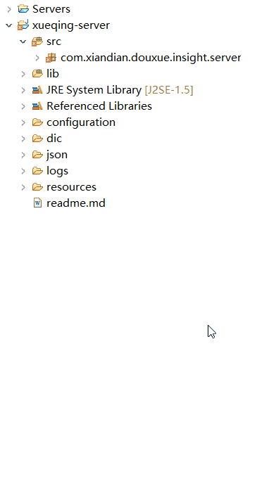

# 云计算大数据部分
1. xueqing-serve项目解读
   > 该项目是比赛中需要编写服务代码的项目，作用是对整个大数据得分模块功能数据的操作。主要操作有对数据的爬取，对数据的清戏，对数据中岗位的聚类，对岗位的分类推荐

2. 爬虫
   >前提条件 已经导入mongodb数据库，habse数据库，启动了大数据所需服务(mongodb,hadoop,zooker,hbase)，这些部分在所给资源包中有说明，请自行配置启动

    * 修改配置文件
    
    **修改该config文件下的需要配置的配置文件(修改ip地址,使用hbase虚拟机的ip地址,可通过在虚拟机中ipconfig指令来查询)**

    -------------------------------------------------------------------------------------------------------------
    * 编写爬虫代码
    ```java
    	/**
	 * 爬虫单个页面的处理方法
	 */
	@Override
	public void process(Page page) {
		// Init select and urls
		Selectable select = null;
		List<String> urls = null;
		// 列表页面，这里是通过搜索来确定
		try {
			if (!page.getUrl().toString().contains("html")) {
				// 列表区域
				select = page.getHtml().xpath("//p[@class='PositionName']");
				urls = select.links().all();
				page.addTargetRequests(urls);
				System.out.println(page);
				// 分页区域
				select = page.getHtml().xpath("//ul[@id='pagination']");
				urls = select.links().all();
				// 遍历是否存在了
				Iterator<String> it = urls.iterator();

				while (it.hasNext()) {
					String x = it.next();
					if (x.equals(breakUrl)) {
						it.remove();
					}
				}
				// 收集下一级的url
				page.addTargetRequests(urls);
			}
			// 岗位页面
			else{
				// 检查本页面是否爬过？岗位ID
				Matcher matcher = pattern.matcher(page.getUrl().toString());
				String pageID = null;
				while (matcher.find()) {
					pageID = matcher.group(1);
				}
				// 如果没有ID，不处理
				if (pageID == null) {
					return;
				}
				Map<String, Object> map = new HashMap<>();
				String JsonContext = ReadFile
						.ReadFile(System.getProperty("user.dir") + "/configuration/job_config.json");
				JSONObject jsonObject = new JSONObject(JsonContext);
				JSONArray wbsites = jsonObject.getJSONArray("wbsites");
				for (int i = 0; i < wbsites.length(); i++) {
					JSONObject wbsite = wbsites.getJSONObject(i);
					String wbsitename = wbsite.getString("wbsitename");
						// 设置来源
						map.put("resource", wbsitename);
						JSONArray fields = wbsite.getJSONArray("fields");
						for (int j = 0; j < fields.length(); j++) {
							JSONObject field = fields.getJSONObject(j);
							String chinesename = field.getString("chinesename");// 标签的中文名称
							String name = field.getString("name");// 英文名称
							String path = field.getString("path");// 爬虫网页标签路径
							// ?
							if (path.startsWith("//")) {
								
								String objectStr = Format_transform.gb2312ToUtf8(page.getHtml().xpath(path).toString());// 性能很差
								map.put(name, Format_transform.change(objectStr));
							} else {
								String objectStr = Format_transform.gb2312ToUtf8(page.getHtml().regex(path).toString());
								logger.info(chinesename + ":" + objectStr);
								map.put(name, Format_transform.change(objectStr));
							}
							// ?
							if (name.equals("companymess")) {
								String companymess = Format_transform
										.gb2312ToUtf8(page.getHtml().xpath(path).toString());
								String[] strs = UtilTools.parseCompony(companymess);
								map.put("nature", Format_transform.change(strs[0]));
								map.put("scale", Format_transform.change(strs[1]));
								map.put("industry", Format_transform.change(strs[2]));
							}
						}
				}
				// 设置url
				map.put("url", page.getUrl().toString());

				// 保存到HBase中，并设置结束日期为明天    && isExist == false
				if (pageID != null ) {
					map.put("id", pageID);
					// HDFS存储位置
					map.put(HDFS, job_rawdata_path + pageID + Suffix);
					// 插入数据
					jobDataReposity.insertData("job_internet", map);
					// 下载文件，存入HDFS
					saveToHdfs(page.getUrl().toString(), job_rawdata_path);
				} else {
					// 找到这个岗位，设置它的结束日期为今天+1，每个岗位的开始日期和结束日期，目的为了统计持续周期
					jobDataReposity.insertEndTime("job_internet", map);
				}
			} 
		} catch (Exception exp) {
			logger.error(exp.toString());
		}
	}

	/**
	 * 保存数据到hdfs
	 * 
	 * @param urlname
	 * @throws IOException
	 */
	private void saveToHdfs(String urlname, String savepath) throws IOException {
		URL url = new URL(urlname);
		Pattern pattern1 = Pattern.compile("/([0-9]+)\\.html");
		Matcher matcher1 = pattern1.matcher(urlname);
		String num = null;
		while (matcher1.find()) {
			num = matcher1.group(1);
		}
		FileOutputStream fos = null;
		InputStream is;
		is = url.openStream();
		HdfsClient hdfsClient = HdfsClient.getInstance();
		HdfsClient.uploadByIo(is, savepath + num + ".html");	
	}
    ```
    
    **这两个方法在WYjobPageCrawler.java下。具体含义自行参照[webmagic](https://github.com/code4craft/webmagic)框架**
    ----------------------------------------------------------------------------------
    * 启动爬虫服务
        - 在启动服务前应该先开启我们爬虫对象的站点

            在tomcat中加载xueqing-web的war包或者在eclipse中import xueqing-web的项目然后启动tomcat运行项目
        - 启动爬虫服务

            ```java
                @Override
	            public ServiceState start() {

                //1. 启动收集服务（虫）
                Service jobCollector = new JobCollectService(server, this);
                jobCollector.start();
                // 2. 启动清洗服务（清洗）
                //Service jobCleaner = new JobCleanService(server, this);
                //jobCleaner.start();
                // 3. 启动分析服务（聚类）
                //Service jobCluster = new JobClusterService(server, this);
                //jobCluster.start();
                return ServiceState.STATE_RUNNING;
            }
            ```
            **JobAnalysisService.java中只解除启动收集服务的注解**
            **然后运行EduInsightServer.java启动服务**

3. 数据清洗
4. 岗位据类
5. 岗位推荐

